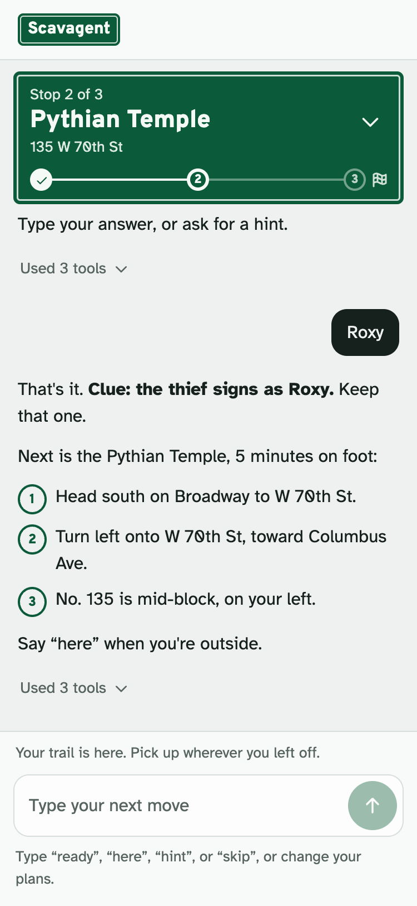
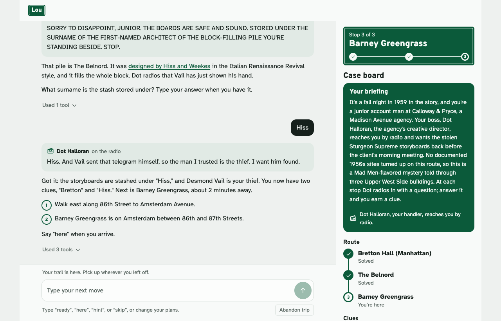

# Lou

Lou turns a walk through New York City into a short mystery. Tell it where you're starting, and if you like, how long you have, where you need to end up, a stop you must pass, and a theme. Lou researches real places on your way, times the route, writes a story whose clues you earn at each stop, and guides you there one stop at a time. At some corners, a city traffic camera takes your souvenir photo.

Try it: https://scavagent-b57mvtutma-ue.a.run.app

<p>  </p>

Built by Jan Barganowski and Kyle Coletta for Agentic AI for Data Science (IEOR4570) at Columbia University, October 2026.

## Try these

1. "I'm at Central Park West and West 86th Street. Give me a 1960s spy adventure."
2. "I'm at Central Park West and West 86th Street. I have 45 minutes, need to finish at West 72nd Street and Broadway, and must pass West 81st Street and Columbus Avenue. Walking only, architecture theme, and include a camera stop if one fits."
3. Once an adventure is under way (after query 2, say "ready", then that you've reached the first stop): "Skip the next optional stop. I have only 15 minutes left, and I still need to reach my destination."

Planning takes a minute or two, and the page shows each tool as it runs. In query 2 the camera stop is at Broadway and West 72nd Street. The camera spots were matched on the camera image rather than tested in person, so Lou says so and offers a retake if you can't find yourself in the photo.

## How it works

You say where you are. Lou finds real places nearby and gathers sourced facts about them from Wikipedia and NYC landmark records, routes the walk (or a subway ride, if you allow it), and writes a story with a briefing, a handler who radios in, and a clue at each stop. Before you see the plan, the plan evaluator checks it: the times add up, every fact has a source, no real person is cast in the fiction, and the clues lead to the solution. A plan that fails goes back to Lou to fix.

On the walk, a green street sign at the top of the page shows the current stop. Tap it for the case board: your briefing, the route, the clues you've earned, and your photos. To start over, press Abandon trip under the message box. After you confirm, it clears this conversation and opens a fresh page. Every reply lists the tools it used, and the `/chat` response returns them as `tool_calls`, each with its `name`, `args`, and `result`.



## Tools

| Group | Tools |
|---|---|
| Plan evaluator | `evaluate_adventure_plan` |
| Camera souvenirs | `find_camera_checkpoints`, `capture_camera_checkpoint` |
| Places and research | `geocode_place`, `find_places`, `research_place` |
| Routes and transit | `get_route`, `get_transit_arrivals`, `get_next_directions` |
| Progress | `save_adventure_plan`, `get_adventure_state`, `update_adventure_state` |

What each tool does, where its data comes from, and how errors reach the model: [docs/TOOLS.md](docs/TOOLS.md).

## How it runs

The server is FastAPI with a LiteLLM tool-calling loop (`app.py`), and the page is a single HTML file (`index.html`). It runs on Google Cloud Run, which rebuilds and redeploys on every push to `main`. Sessions are stored in Firestore and camera photos in Cloud Storage. The model is Claude Sonnet 5.5 through Anthropic's API, with the key kept in Secret Manager; if Claude can't answer, Gemini 3.5 Flash-Lite takes the turn. Why Sonnet: [docs/MODEL_COMPARISON.md](docs/MODEL_COMPARISON.md).

## Run locally

With Python 3.10 or later and `uv`:

```sh
uv sync
gcloud auth application-default login
uv run app.py
```

Then open http://localhost:8000. Locally the model defaults to Gemini 3.5 Flash-Lite on Vertex AI, which is what the `gcloud` login is for. To use Claude as the live site does, export `SCAVAGENT_MODEL=anthropic/claude-sonnet-5-5` and `ANTHROPIC_API_KEY` first. Other settings are in [.env.example](.env.example).

The tests run without network access: `uv run pytest` and `node --test tests/frontend.test.cjs`.

## More

- [docs/TOOLS.md](docs/TOOLS.md): every tool in detail.
- [docs/STORY_DESIGN.md](docs/STORY_DESIGN.md): what makes a good adventure, and how one plays.
- [docs/MODEL_COMPARISON.md](docs/MODEL_COMPARISON.md): the seven models we compared.
- [docs/CONTRIBUTIONS.md](docs/CONTRIBUTIONS.md): who built what.
