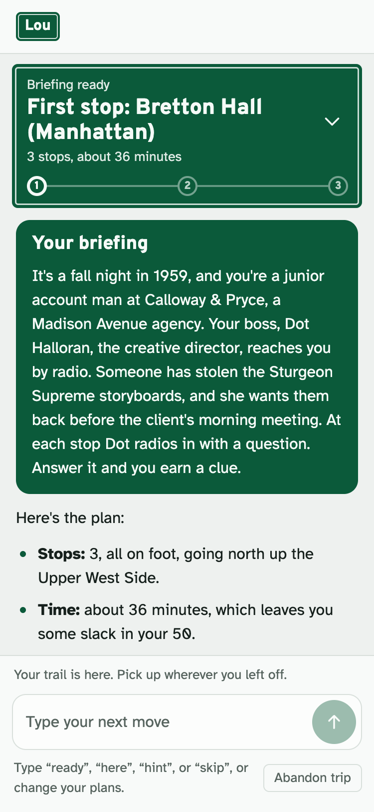
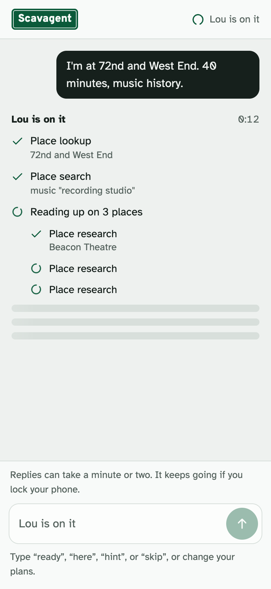
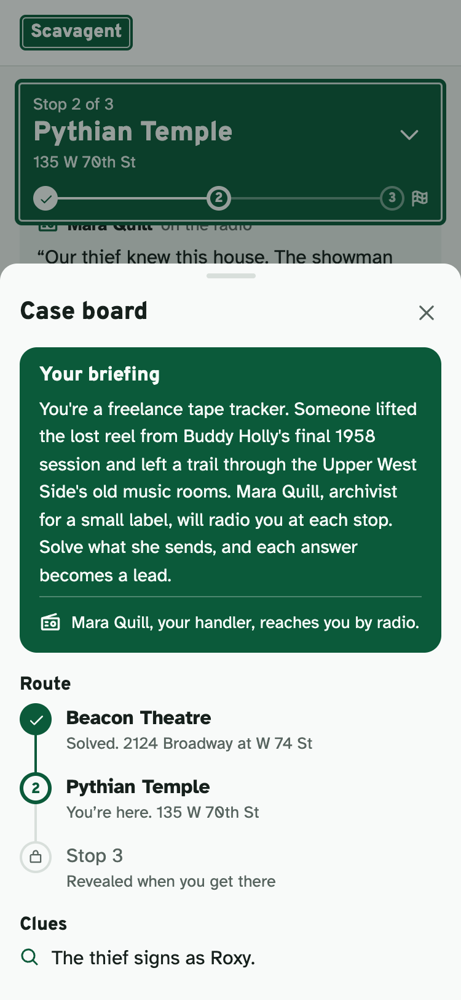

# Lou

Lou is a chat agent that turns a walk through New York City into a short mystery adventure. Tell it where you are, and optionally how much time you have, where you need to end up, a stop you must pass, how you want to travel, and a theme. It then:

- researches real places near your route (Wikipedia and NYC Landmarks Preservation Commission records);
- times the route on foot and by subway;
- writes a story whose clues you earn at each stop;
- guides you stop by stop in chat.

At verified viewpoints it can save an NYC DOT traffic-camera still of you as a souvenir. Built by Jan Barganowski and Kyle Coletta for a Columbia agents course (October 2026).

**Try it:** https://scavagent-b57mvtutma-ue.a.run.app. It runs Claude Sonnet 5.5, and the site deploys from `main` through Cloud Run continuous deployment.

## How to use it

- **Start:** type where you are. Everything else is optional. Lou, the guide, answers with a briefing (your role, your handler, the mission), the stops, the time it takes, and the first stop.
- **Play:** type "ready" to get directions, and tell it when you arrive. It gives you a task at each stop, a puzzle or something to look at, and your answer earns a clue for the case. You can ask for a "hint", "skip" a stop, or change plans ("I only have 15 minutes left").
- **Chat only:** everything happens in the chat box. Sharing your browser location is optional and only helps with directions.
- **The sign and the case board:** once you have a briefing, a green street sign at the top shows the current stop. Tap it for the case board: the briefing, the route (later stops stay locked until you reach them), the clues you've earned, and your photos. On a computer the board is a column on the right.
- **Tool calls:** while Lou works, each tool appears as it starts and ticks off as it finishes (`GET /progress`). Each reply then lists the tools it used behind a "Used N tools" line. The `/chat` API returns `response`, `session_id`, and `tool_calls` (each with `name`, `args`, and `result`).

<p>  </p>

## Sample queries for graders

1. "I'm at Central Park West and West 86th Street. Give me a 1960s spy adventure."
2. "I'm at Central Park West and West 86th Street. I have 45 minutes, need to finish at West 72nd Street and Broadway, and must pass West 81st Street and Columbus Avenue. Walking only, architecture theme, and include a camera stop if one fits."
3. A follow-up once an adventure is under way (for example after query 2, "ready", and reaching the first stop): "Skip the next optional stop. I have only 15 minutes left, and I still need to reach my destination."

Planning a researched adventure takes up to a minute or two while the agent searches, routes, and checks its plan. The page keeps waiting on its own. Camera stops appear only at standing spots a person has approved: 151 in Manhattan (Upper East/West Side and Midtown), each matched on the live camera image and map imagery rather than tested in person, which Lou tells the user while offering a retake. In query 2 the camera stop is the viewpoint at Broadway and West 72nd Street, next to the finish; where no spot fits, Lou says so. `scripts/acceptance_checks.py <URL>` replays all three queries against a running app and checks what must hold.

## Tools

Full descriptions, sources, and configuration are in [docs/TOOLS.md](docs/TOOLS.md).

| Tool | What it does |
|---|---|
| `evaluate_adventure_plan` | **Kyle's original tool.** Builds the agent's draft into a routed plan and checks it before the user sees it: timing against the user's limits, required stops and their order, travel modes, sourced facts and links, and the story rules (briefing, introduced characters, clues that add up, theme links, no real people as characters). A plan that fails can't be saved. |
| `find_camera_checkpoints`, `capture_camera_checkpoint` | **Jan's original tool.** Finds NYC DOT traffic cameras at pedestrian standing positions a person verified on the camera image and map, or in the field (never the camera's mounting point). When the user says they're in position, it saves the live still as a souvenir, at most once per message, and shows it again in the finale. |
| `geocode_place`, `find_places`, `research_place` | Resolve typed places, find candidate stops, and gather sourced facts (Wikipedia revisions, NYC LPC records). |
| `get_route`, `get_next_directions` | Walking routes (OpenStreetMap Valhalla) and subway/bus legs (Google Routes), directions to the next stop. |
| `get_transit_arrivals` | Live subway arrivals and service alerts (MTA GTFS-realtime). |
| `save_adventure_plan`, `get_adventure_state`, `update_adventure_state` | Save a passing plan and keep progress server-side: stops completed or skipped, clues revealed, photos, arrival. |

## Run locally

Use Python 3.10 or later and `uv`. The model is set by `SCAVAGENT_MODEL`.
- **The deployed site** runs Claude Sonnet 5.5 through Anthropic's API (`anthropic/claude-sonnet-5-5`). If Claude can't answer, Gemini 3.5 Flash-Lite on Vertex AI answers instead. Why Sonnet: [docs/MODEL_COMPARISON.md](docs/MODEL_COMPARISON.md).
- **Locally**, the default is Gemini 3.5 Flash-Lite on Vertex AI. It uses Google Application Default Credentials and the project `agentic-ai-msds`.

```sh
uv sync
gcloud auth application-default login
uv run app.py
```

To run the deployed model locally, export `SCAVAGENT_MODEL=anthropic/claude-sonnet-5-5` and your `ANTHROPIC_API_KEY` before `uv run app.py`.

Open http://localhost:8000. Sessions persist in `.data/scavagent.db`, so a conversation and its progress survive a restart. Other settings are in [.env.example](.env.example). For a synthetic test adventure, start with `SCAVAGENT_DEV_FIXTURES=1 uv run app.py` and ask for "the constrained_route test adventure"; its places and clues are invented and labeled as such.

Checks: `uv run pytest` (runs without network access) and `node --test tests/frontend.test.cjs`.

## Project docs

- Tools: [docs/TOOLS.md](docs/TOOLS.md). Who built what: [docs/CONTRIBUTIONS.md](docs/CONTRIBUTIONS.md).
- Story design: [docs/STORY_DESIGN.md](docs/STORY_DESIGN.md). Model choice: [docs/MODEL_COMPARISON.md](docs/MODEL_COMPARISON.md).
