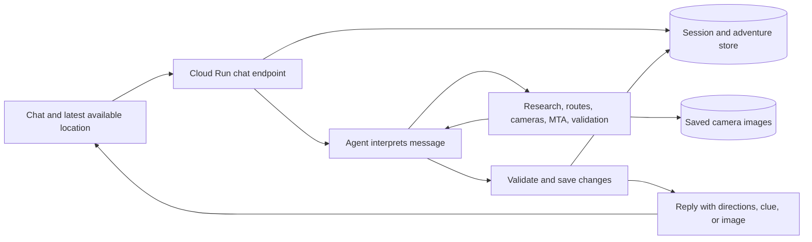

# Scavagent — product and implementation proposal

September 28, 2026. Team: Jan Barganowski and Kyle Coletta. Due: October 7, 2026.

The overall design has been accepted for planning; the ownership and phases below are proposed working assignments. This is not an implemented application or a promise that every integration is ready. It incorporates the updated assignment and supersedes conflicting assumptions in the earlier product notes. Model choice remains deferred; Jev is excluded. Spotify soundtracks are an optional final addition after the core adventure works and has been tested.

Repository: https://github.com/jan-barg/scavagent

Use your own repository checkout. See [START_HERE.md](START_HERE.md) for local setup and agent entrypoints.

## 1. Product and initial scope

Scavagent builds a fictional adventure around researched NYC places and guides the user through it entirely in chat. Preferences affect the places, route, activities, and story. A curated camera checkpoint can produce a real souvenir of the outing.

Only the starting location is required. Accept it as a typed address, intersection, landmark, or a usable browser location. Optional inputs are destination, time budget or arrival deadline, required stops, allowed transport, and theme. Do not turn those optional fields into a mandatory interview.

Proposed defaults: walking and MTA allowed, paid car travel opt-in, public outdoor stops without required purchases, a playful NYC mystery if no theme is supplied. If no time or endpoint is given, propose a short first chapter of two or three stops, approximately 20–30 minutes subject to actual routing. This is a suggested chapter length, not an invented user deadline. Offer continuation conversationally. Do not assume the user must return to the start.

For October 7, prioritize a complete experience in one field-tested area with roughly 6–10 usable camera viewpoints if fieldwork supports that many. The minimum useful milestone is three verified viewpoints and several alternate non-camera stops. Ordinary discovery may work farther afield, but photo coverage must be described accurately. Choose the area after checking camera quality and researchable places; do not promise citywide photo coverage.

Keep the interface to a conversation, text composer, and Send. Directions, source links, photos, tool activity, and the final case file appear inside messages. Users type check-ins, answers, hints, skips, and changes. There are no extra checkpoint controls. A proposed single session can serve a solo user or friends sharing one phone; separate synchronized accounts are outside the first version.

## 2. Revised adventure process

1. **Understand the request.** Resolve the starting location and extract optional preferences and constraints. Ask only when an ambiguity prevents useful planning.
2. **Establish the baseline journey.** If there are required stops or a destination, route those first, accounting for stated order, opening windows, dwell time, and deadlines. Identify whether any time remains for the adventure.
3. **Discover candidates.** Search nearby or along the baseline journey for theme-relevant places, and query the curated camera checkpoint catalogue separately. A camera can be a story device even when it has no historical connection to the chosen era.
4. **Research physical and historical details.** Associate claims with actual source pages and the correct address. Record what activities each place can support and what remains uncertain.
5. **Choose stops and order together.** Evaluate travel and activity time for proposed combinations. Hard constraints determine eligibility; theme fit, interest, variety, evidence quality, and camera value determine preference among feasible routes.
6. **Create the story and activities.** Write a compact premise, cast, progression, and ending around the feasible places. Prepare each checkpoint's activity, hints, completion rule, and fallback. Validate physical requirements before offering the plan.
7. **Save and present the plan.** Store the full private plan, evidence references, and status. Show the user duration, number of stops, broad destination, and opening story without spoiling all the clues. If their initial request clearly asks to start, begin; do not require a ritual confirmation phrase.
8. **Guide one conversation turn at a time.** Each new user message loads progress, handles its intent, calls useful tools, saves changes, and replies. Walking between messages requires no running model.
9. **Capture at camera checkpoints.** After positioning instructions and a readiness message, retrieve and save the current still. Let the user inspect it and ask for another attempt if needed.
10. **Adapt and finish.** Replan remaining stops when needed, preserve past events, resolve the plot, and assemble the already saved photos and discovered facts into a final case file or postcard.

## 3. Making fiction interesting without inventing the street

Store three distinct types of content:

| Layer | Contents | Requirement |
|---|---|---|
| Real place facts | Historical events, architecture, addresses, access information | Source supports this specific claim about this specific place |
| Physical activities | Inspecting a documented feature, observing something on arrival, standing in a calibrated camera view | Current enough evidence of the feature, or confirmation from the user; always an alternative |
| Fiction | Invented characters, motives, coded messages, stakes, choices, and revelations | Presented as the adventure's fiction, not as historical fact |

Example of fictional framing: “It is 1964. A courier has disappeared with a recording. Three messages will tell you who has it.” After selecting and researching real places, connect their supported facts to this fictional plot. A fictional surveillance checkpoint gives a contemporary traffic camera a role in an era-themed story without pretending the camera existed then.

Each stop should change the story: reveal a clue, challenge a suspect's account, force a choice, or reinterpret an earlier discovery. Merely attaching an unrelated trivia paragraph to each address will feel like a tour with decorative prose. Store the central mystery, solution, known facts, and revealed clues so later messages remain consistent.

Use three robust activity patterns:

- **Verified feature:** ask about an inscription or architectural detail that fieldwork or a sufficiently current source actually establishes. Store evidence and an answer or acceptance rule. An article about a building's history does not prove a plaque is there today.
- **User observation:** “Describe one detail that catches your eye.” Use the reply in the fiction without claiming independent verification. A missing feature cannot make this task unsolvable.
- **Chat-delivered puzzle:** give a fictional telegram, clue, or choice in chat when the user reaches the real place. Its solution uses information actually supplied to the user, so it does not depend on a hidden object or an unprepared stranger.

Do not invent a physical envelope, helpful shopkeeper, accessible interior, mural, inscription, or actor waiting for the user. Do not claim an invented crime happened at a real address. Phrase plot material as fiction and historical material as sourced fact.

The plan validator can reject references to missing evidence, unsolvable dependencies, missing fallbacks, or absent answer rules. It cannot prove arbitrary web text is true. Field checks, primary sources, claim review, and graceful recovery remain necessary. Another model saying “verified” is not new evidence.

Prepare a narrative outline and checkpoint payloads at planning time; generate natural replies as the user plays. Use a small set of reusable activity patterns, while discovering and selecting actual places dynamically. This preserves real tool use without requiring a library of premade hunts.

## 4. Defining the valid area

Use **travel-time feasibility** as the deciding rule. A rectangle, neighborhood name, or north/south street range can narrow a search but cannot establish that an outing fits. Rivers, park entrances, street layout, subway connections, and required stops matter.

| Inputs | Search strategy |
|---|---|
| Start + destination + deadline | Discover places along a baseline route, then admit detours only when the whole remaining route fits |
| Start + time, no destination | Search a reachable area; do not reserve a return journey unless requested |
| Start + destination, no time | Find modest detours, show the estimated total, and let the user extend or shorten it |
| Start only | Build a bounded local first chapter, then offer another chapter |

For a route with a deadline:

`travel time + time at required stops + time at adventure stops + contingency <= time remaining`

Example: the user has 60 minutes. The baseline route through their required stop to the destination takes 25 minutes, their required stop needs 10 minutes, and the plan reserves 5 minutes for uncertainty. There are 20 minutes left for additional detours and adventure activities. Two nearby stops might fit; a highly relevant 25-minute detour does not.

Implementation for the first version:

1. Use broad radius/route-area filtering to discover perhaps 10–15 candidates, not hundreds.
2. Search in plain language using neighborhood and street names; geocode results into actual coordinates. Search does not need to understand a raw coordinate rectangle.
3. Eliminate mismatched addresses, weak evidence, inaccessible stops, and clearly impractical detours.
4. Evaluate a few promising stop combinations and orders using a routing service. Select about 2–4 adventure stops for the first release.
5. Check the final ordered route, including dwell times and actual departure times, before saving it. Individual candidates that fit separately may not fit together.

A full isochrone polygon—an area reachable within a time limit—is optional. You can make the right decisions with candidate travel times without generating or displaying that polygon. Avoid building a custom transit router for this deadline.

If Google Routes is selected, it supports transit directions with walking connections, but transit requests do not accept intermediate waypoints. Evaluate consecutive adventure legs separately at their expected departure times and refresh the next transit leg when needed. Inspect actual modes returned rather than assuming a preference guarantees a permitted itinerary. [Google Routes transit documentation](https://developers.google.com/maps/documentation/routes/transit-route).

MTA feeds supply arrival/service information; keep journey routing a separate responsibility. [MTA developer resources](https://www.mta.info/developers).

If Uber is allowed, a driving duration is only a partial estimate: pickup time also matters. The initial product can suggest a car leg without booking it. If the baseline journey already exceeds the deadline, explain that and ask which constraint can change; do not manufacture a feasible adventure.

## 5. Curated camera checkpoints

Keep camera hardware coordinates separate from the **place where the participant stands**. Directions must target the standing place. One camera can have multiple calibrated views or standing positions; only enable a position when its reference view remains usable.

Each catalogue entry should contain:

| Field | Purpose |
|---|---|
| `checkpoint_id`, `camera_id` | Stable internal checkpoint and source identifiers |
| `stand_location` | Latitude/longitude of a verified public pedestrian position |
| `address`, `landmark`, `side_of_street` | Instructions that are usable despite GPS error |
| `positioning_instructions` | Where to stand and which direction to face |
| `reference_image`, `reference_view_notes` | Expected framing and recognizable landmarks |
| `person_region` | Approximate area in the reference image where the participant appears; optional aid, not face identification |
| `last_field_verified_at`, `visibility_notes` | Evidence of usability, lighting limitations, expected person size, occlusion risks |
| `enabled`, `fallback_checkpoint_id` | Whether it can currently be offered, and an alternative |

Calibration is a small fieldwork exercise: one teammate stands at a proposed location while the other checks the camera image; record an exact pedestrian landmark, example frame, and instructions. Camera catalogue coordinates alone are not enough. The previously checked Central Park West/86th Street feed establishes a potentially useful sidewalk view, but we have not yet calibrated a participant standing position there.

DOT may reposition cameras, so “tested before” cannot mean “guaranteed visible forever.” Check the feed before sending someone there, use reference landmarks when reviewing the view, and let an unusable view become a skip or alternate activity. An online flag alone does not establish matching framing. [DOT camera information](https://www.nyc.gov/html/dot/html/motorist/atis.shtml).

Selected prototype source remains the public catalogue at `https://webcams.nyctmc.org/api/cameras` and the catalogue's `imageUrl`, typically `https://webcams.nyctmc.org/api/cameras/{id}/image`. This access method was verified earlier in this project. Restrict fetches to known catalogue IDs and host URLs.

Capture flow: directions → user types “ready” → a short update allowance if necessary → retrieve still → store image with checkpoint and retrieval time → show preview in chat. Previously reviewed subscriber guidance described approximately 15-second refreshes; the still request does not operate a shutter. A repeated frame or unclear person can prompt another user-requested attempt. Treat retrieval time and the image's own timestamp as different facts; do not invent capture-time precision.

Save images at each stop and use those files for the finale. DOT provides live stills and does not record footage for later retrieval. A camera URL in the final message alone would show whoever is there at that later time. [DOT camera information](https://www.nyc.gov/html/dot/html/motorist/atis.shtml).

The user confirms whether they are visible. No facial recognition is necessary. Store asset identifiers and metadata in state; image bytes belong in object storage and should not be pasted into model history. Use controlled app media URLs that the chat can render. Technical access is the established implementation choice; this plan does not assert separate reuse authorization.

## 6. State and the conversation loop

Use one agent with planning and guiding behaviors, one backend, and durable session storage. Separate planner/executor services or continuously running agents are unnecessary for the class version.



Your “while loop” is the user's repeated conversation, not a server request held open for an hour. A normal turn is: load state → interpret message → call tools as needed → validate/save changes → return response. During a walk or locked phone, the saved adventure waits.

Store the following logical records; they need not all be one large database document:

| Record | Contents |
|---|---|
| Session | Opaque session identifier, owner capability/cookie, conversation, creation/update times |
| Constraints | Starting location, optional destination/deadline, required stops, transport, theme, explicit preferences and stated defaults |
| Latest location | Coordinates or typed place, source, observation time, accuracy when available |
| Adventure plan | Version, status, ordered stop IDs, route legs, estimated arrivals/dwell times, contingency |
| Place/evidence records | Stable place IDs, coordinates, claim-to-source references, access and physical-feature evidence |
| Checkpoints | Directions, activity type, physical prerequisites, puzzle payload, answer/acceptance rule, hints, fallback, camera reference |
| Story | Premise, cast, solution, planned beats, revealed beats, fictional items and consequential choices |
| Progress | Current stop, completed/skipped/blocked stop IDs, user reports and timestamps |
| Photo records | Asset ID, checkpoint/camera ID, retrieval time, known frame timestamp, user visibility confirmation |

An illustrative checkpoint structure:

```json
{
  "id": "stop_2",
  "place_id": "place_7",
  "status": "pending",
  "required_by_user": false,
  "estimated_dwell_minutes": 4,
  "activity": {
    "type": "chat_puzzle",
    "payload": "Fictional clue text delivered on arrival",
    "physical_requirements": [],
    "evidence_ids": [],
    "answer_rule": "Accept the answer derived from the supplied clue",
    "hints": ["First hint", "Second hint"],
    "fallback": "Reveal the clue and continue if the user skips"
  },
  "story_beat_id": "reveal_2",
  "camera_checkpoint_id": null,
  "photo_asset_ids": []
}
```

A physical observation checkpoint adds specific physical requirements and evidence IDs. The server checks referenced records exist and are suitable; it does not accept invented evidence IDs. Photo records begin unconfirmed and do not become proof of a person's identity.

Use narrow, validated state operations: save a validated plan, mark a stop complete/skipped/blocked, update a user constraint, record a clue reveal, replace remaining stops. Include a plan version to reject stale updates. Bind state tools to the current server-side session so the model does not pick which user's data to edit. Handle message retries without duplicating completion or captures.

Recommended storage for this Google Cloud deployment: Firestore for session/adventure records and Cloud Storage for image assets, accessed through the backend. Retain the starter's FastAPI/tool harness. Its current in-memory session dictionary and browser-only variable are insufficient for dependable reloads, instance changes, and resumptions. Cloud Run local files disappear when an instance stops, so use external persistence. Also change the server listener to `0.0.0.0` and the provided `PORT`. [Cloud Run runtime contract](https://docs.cloud.google.com/run/docs/container-contract).

Request browser location permission at the beginning. While the page is visible, ordinary browser code keeps the latest useful fix. Attach that fix, timestamp, and accuracy when sending a message; do not send every movement through the model or save a continuous trail. Refresh after returning to the page, and use typed places when permission is denied or readings are stale/inaccurate. Being geographically close does not prove a challenge is complete or establish the correct sidewalk. Background operation while the phone is locked is not a dependency. [W3C Geolocation specification](https://www.w3.org/TR/geolocation/).

Keep the whole plan in storage, but send the model a compact state summary, the current/next checkpoint, relevant evidence, and recent conversation. Preserve durable user preferences and plot reveals explicitly. Retrieve older detail when needed; do not repeatedly include full source pages, every route candidate, or image bytes. No additional context-scoring model is needed.

## 7. Adjusting the adventure

Example: “Skip the next stop; I only have 20 minutes now.”

1. Record the changed time budget and the declined stop. Preserve completed stops, photos, and revealed story facts.
2. Recompute from the latest reliable current location and current time, including the destination and remaining required stops.
3. Drop or replace optional stops; check remaining travel, dwell, opening windows, and buffer again.
4. Move an unrevealed fictional clue to another suitable checkpoint or deliver it in chat. Do not move historical facts to an unrelated address.
5. Save a revised plan and explain the practical change briefly: “That leaves room for one final clue on the way to your destination.”

If the user explicitly declines a previously required stop, that changes their requirement. If a required stop becomes unavailable and they have not waived it, say so and ask about a substitute. Never silently omit a required errand to preserve the story. If no feasible adventure remains, shorten the story to a chat ending and provide the most useful onward route.

Every challenge has a no-blocking fallback. Incorrect answers, an offline camera, a missing detail, or an inaccessible location must not trap the user. Skipping can change the fiction without manufacturing a claim that they completed the physical task.

## 8. Tools and originality

Keep the agent responsible for interpreting preferences, selecting candidates, constructing the narrative, and responding to changes. Give tools reliable data and explicit calculations rather than moving the whole product into a fixed scripted hunt.

| Tool | Arguments and useful result |
|---|---|
| `find_places` | Area/query/theme hints → real candidate identities, addresses, coordinates, source references |
| `research_place` | Place ID, research question → supported claims and physical details with URLs, dates, uncertainties |
| `get_route` | Origin/destination, departure time, permitted modes → route, travel duration, steps, mode details, warnings |
| `get_transit_arrivals` | Station, direction, lines → MTA predictions, feed time, relevant alerts; scheduled times labeled if used |
| `find_camera_checkpoints` | Search region/corridor, detour allowance, needs → calibrated standing positions, instructions, usability information, estimated detour |
| `capture_camera_checkpoint` | Approved checkpoint ID → stored image asset, retrieval/frame time, status and retry guidance |
| `find_filming_records` | Area/date range/purpose → matching permit evidence with coverage dates; explicit unavailable/stale status for unsupported current requests |
| `evaluate_adventure_plan` | Proposed stops/order/activities and state version → timed feasibility, physical-evidence checks, story dependency failures, actionable violations |
| `get_adventure_state` | Relevant detail selector → state within the current session |
| `update_adventure_state` | Expected version and allowed changes → persisted state/version or specific validation failure |

These are proposed contracts, not fixed implementation signatures. `research_place` may combine web search and page retrieval, but it must return traceable evidence; a search snippet alone is often insufficient. Schema constraints and server checks should reject malformed arguments, unauthorized camera URLs, unsupported modes, and invalid state transitions.

The assignment requires two original tools for two people. Generic MTA, search, or map wrappers alone are a weak originality case. Proposed substantial original contributions:

- **Jan: `find_camera_checkpoints`.** Build the pedestrian viewpoint dataset and a selector that reasons over calibrated standing positions, framing reliability, and route detours. Document field verification and how its output differs from listing nearby camera hardware.
- **Kyle: `evaluate_adventure_plan`.** Build an evaluator that combines travel/dwell/deadline feasibility with physical evidence requirements and clue dependencies. On replanning it checks that completed/revealed content remains consistent. It should return precise reasons for rejection, not merely ask another model whether the plan seems good.

This split is a suggestion, and no one can guarantee uniqueness against unseen class submissions. Document both tools' actual custom behavior and each person's contribution. Both teammates should understand the shared harness and demonstrate the full product.

All tools need bounded requests and useful errors: unavailable data, expired estimates, missing evidence, wrong direction, infeasible deadline, or stale plan version. An empty search result is different from a failed API. For example, a route failure should invite another candidate/mode or a shorter plan rather than fabricated directions.

## 9. Filming data: a verified limitation

On September 28, 2026, a direct aggregate query to the NYC Film Permits API returned:

```json
{
  "latest_start": "2026-06-29T16:00:00.000",
  "latest_end": "2026-07-29T16:33:00.000",
  "latest_entry": "2026-06-29T07:04:26.000",
  "records_with_start": "19002",
  "records": "19397"
}
```

Query: `SELECT max(startdatetime) AS latest_start, max(enddatetime) AS latest_end, max(enteredon) AS latest_entry, count(startdatetime) AS records_with_start, count(*) AS records` against dataset `tg4x-b46p`.

This establishes that the dataset, as returned in this check, cannot identify a current September 28 set. Recheck before release, but do not base a core mission on the presence of a film crew. Historic permits can support historical filming-location context with their dates. A current lead from another source still needs location/time matching and must not become a guarantee that actors or a visible set will be present. Treat nearby permitted parking as a lead rather than the exact filming spot.

Sources: [NYC Film Permits catalogue](https://data.cityofnewyork.us/City-Government/Film-Permits/tg4x-b46p), [reproducible API aggregate](https://data.cityofnewyork.us/resource/tg4x-b46p.json?%24select=max(startdatetime)%20AS%20latest_start%2Cmax(enddatetime)%20AS%20latest_end%2Cmax(enteredon)%20AS%20latest_entry%2Ccount(startdatetime)%20AS%20records_with_start%2Ccount(*)%20AS%20records).

## 10. Assignment compliance

This design can satisfy the supplied requirements; compliance must be checked against the built, deployed result.

| Assignment requirement | Plan and evidence needed at submission |
|---|---|
| Use supplied starter | Already imported unchanged; extend its FastAPI and tool-calling approach |
| Session memory and separation | Durable conversation/state, restored browser session, independent-user checks |
| At least three tools | The proposed set exceeds three; ship a smaller reliable subset if needed while keeping the core experience |
| At least one external-data tool | Routes, research, cameras, MTA, and permits offer multiple candidates; demonstrate real requests |
| One original tool per member | Two substantive custom tools proposed above; document behavior and authorship |
| Clear tool contracts and graceful errors | Validated schemas, timeout handling, evidence/freshness metadata, actionable failures |
| Preserve `/chat` shape | Always return `response`, `session_id`, and `tool_calls`; each call includes `name`, `args`, `result`, including failed calls |
| Distinct frontend | Mobile chat with Scavagent identity, clear opening examples, directions, clues, inline photos, sources; composer and Send remain the only action controls |
| Show tool calls | Preserve full required traces in API; concise read-only tool activity/results in chat make tool use visible without extra buttons |
| README and grader queries | Setup, purpose, limitations, tools, and three reproducible examples |
| Required root files | Keep `app.py`, `pyproject.toml`, `uv.lock`, `README.md`; add valid `submission.json` |
| Submission metadata | Actual Cloud Run URL and both Jan's and Kyle's Columbia UNIs/emails, not placeholders |
| Deployment | Cloud Run continuous deployment from GitHub; keep reachable until grades are released |
| Explain the work | Both members can explain the agent loop, tools, state, originality, and recovery behavior |

The supplied assignment does not explicitly require Gemini as the model. Keep provider choice deferred. Lecture-specific tool guidance was referenced but not included in the attachment; review it before freezing schemas.

Keep tool results concise and JSON-serializable, with image asset references rather than raw image bytes. Preserve completed tool-call traces if a later step fails; the starter currently drops its accumulated trace on a caught exception. Use safe text/Markdown rendering for chat and controlled inline media, since the starter does not yet implement this experience.

Proposed grader queries, to finalize after the tested area is chosen:

1. “I'm at Central Park West and West 86th Street. Give me a 1960s spy adventure.” Checks that only starting location is mandatory; the place is an example, not a promise of final pilot coverage.
2. “I'm at Central Park West and West 86th Street. I have 45 minutes, need to finish at West 72nd Street and Broadway, and must pass West 81st Street and Columbus Avenue. Walking only, architecture theme, and include a camera stop if one fits.” Checks constraints, research, routes, cameras, and honest infeasibility handling.
3. Follow-up to an active adventure: “Skip the next optional stop. I have only 15 minutes left, and I still need to reach my destination.” Checks remembered constraints, changed timing, replanning, and continuity.

The deployed experience must accept a manually typed NYC location so the grader can test remotely. They should not need to travel to unlock basic planning or replanning. Any demonstration photographs or simulated completion must be labeled, not passed off as the grader's live camera capture.


## Development ownership and phases

See [WORK_SPLIT.md](WORK_SPLIT.md) for the canonical role split and six phases through October 7. Track observed implementation in [STATUS.md](STATUS.md). The shared-contract proposal is in [CONTRACTS.md](CONTRACTS.md).
